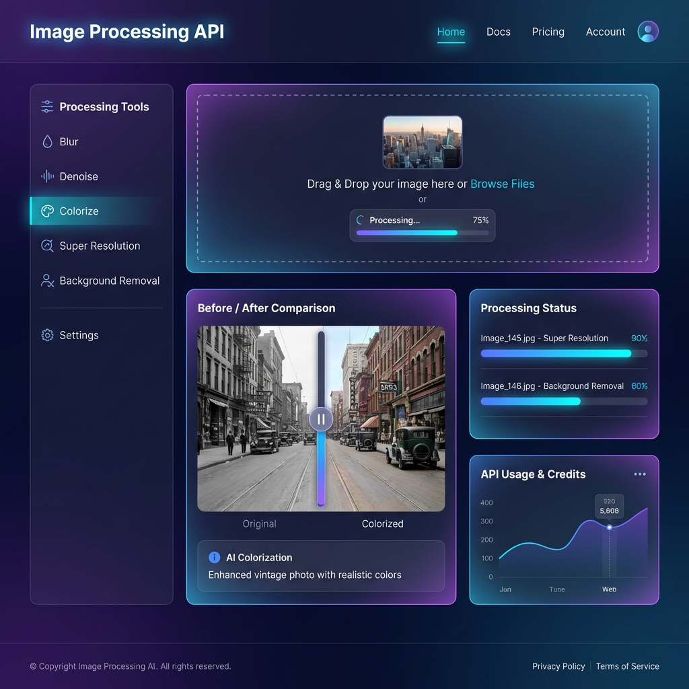

<div align="center">

# 🎨 Image Processing API

[](https://python.org)
[](https://flask.palletsprojects.com/)
[](https://opencv.org/)
[](https://deepai.org/)
[](LICENSE)

**A powerful Flask-based REST API for AI-powered image processing operations**

*Transform your images with blur effects, denoising, AI colorization, super resolution, and background removal*

---

### 🖼️ UI Preview



</div>

---

## ✨ Features

<table>
<tr>
<td>

### 🔧 Local Processing
- **Gaussian Blur** - Smooth & noise reduction
- **Median Blur** - Salt-and-pepper noise removal
- **Bilateral Filter** - Edge-preserving smoothing
- **Motion Blur** - Directional blur effects
- **Denoising** - Advanced noise removal

</td>
<td>

### 🤖 AI-Powered
- **Colorization** - Add colors to B&W images
- **Super Resolution** - 4x upscaling with SRGAN
- **Background Removal** - AI segmentation
- **Powered by DeepAI** - State-of-the-art models

</td>
</tr>
</table>

---

## 🚀 Quick Start

### Prerequisites

- Python 3.9+
- pip package manager
- DeepAI API key (free tier at [deepai.org](https://deepai.org))

### Installation

```bash
# Clone and navigate to directory
cd image_processing

# Create virtual environment
python -m venv venv
source venv/bin/activate  # Windows: venv\Scripts\activate

# Install dependencies
pip install -r requirements.txt

# Set DeepAI API key
export DEEPAI_API_KEY="your-api-key-here"

# Run the application
python app.py
```

🌐 API starts on `http://localhost:5000`

---

## 📡 API Endpoints

### 🏥 Health Check
```http
GET /api/v1/images/health
```

---

### 🌫️ Blur Image
```http
POST /api/v1/images/blur
```

| Parameter | Type | Default | Description |
|-----------|------|---------|-------------|
| `image` | File | - | Image file to process |
| `image_url` | String | - | URL of image (alternative) |
| `method` | String | `gaussian` | `gaussian`, `median`, `bilateral`, `box`, `motion` |
| `kernel_size` | Integer | `5` | Size of blur kernel (odd number) |
| `sigma` | Float | `0` | Sigma for Gaussian blur |

```bash
curl -X POST http://localhost:5000/api/v1/images/blur \
  -F "image=@photo.jpg" \
  -F "method=gaussian" \
  -F "kernel_size=5"
```

---

### 🔇 Denoise Image
```http
POST /api/v1/images/denoise
```

| Parameter | Type | Default | Description |
|-----------|------|---------|-------------|
| `image` | File | - | Image file to process |
| `method` | String | `nlm_color` | `nlm`, `nlm_color`, `bilateral`, `morphological`, `adaptive` |
| `h` | Float | `10` | Filter strength |

---

### 🎨 Colorize Image (AI)
```http
POST /api/v1/images/colorize
```

Transform black & white images into vivid color using neural networks.

```bash
curl -X POST http://localhost:5000/api/v1/images/colorize \
  -F "image=@bw_photo.jpg"
```

---

### 🔍 Super Resolution (AI)
```http
POST /api/v1/images/super-resolution
```

Upscale images 4x using SRGAN while preserving detail.

---

### ✂️ Remove Background (AI)
```http
POST /api/v1/images/remove-background
```

AI-powered automatic background removal.

---

## 🧠 Processing Models

<details>
<summary><b>📊 Blur Filters (OpenCV)</b></summary>

| Method | Description | Best For |
|--------|-------------|----------|
| **Gaussian** | Gaussian kernel smoothing | General smoothing |
| **Median** | Median of neighbors | Salt-and-pepper noise |
| **Bilateral** | Edge-preserving | Preserving edges |
| **Box** | Simple averaging | Fast smoothing |
| **Motion** | Directional blur | Motion effects |

</details>

<details>
<summary><b>🔇 Denoising Methods (OpenCV)</b></summary>

| Method | Description | Best For |
|--------|-------------|----------|
| **NLM** | Non-Local Means | High-quality denoising |
| **NLM Colored** | NLM for color | Color images |
| **Bilateral** | Edge-preserving | Sharp edges |
| **Morphological** | Opening/closing | Binary noise |
| **Adaptive** | Adaptive threshold | Documents |

</details>

<details>
<summary><b>🤖 DeepAI Models</b></summary>

| Endpoint | Model | Description |
|----------|-------|-------------|
| **Colorizer** | Neural Colorization | Deep learning colorization |
| **torch-srgan** | SRGAN | 4x upscaling with GAN |
| **background-remover** | Semantic Segmentation | AI background removal |

</details>

---

## 📁 Project Structure

```
image_processing/
├── 📄 app.py                      # Flask entry point
├── 📄 requirements.txt            # Dependencies
├── 📁 assets/                     # UI assets & images
├── 📁 config/
│   └── settings.py                # Configuration
├── 📁 controllers/
│   └── image_controller.py        # REST API endpoints
├── 📁 services/
│   ├── base_processor.py          # Abstract base class
│   ├── 📁 filtering/
│   │   ├── blur_service.py        # Blur operations
│   │   └── denoise_service.py     # Denoising
│   ├── 📁 enhancement/
│   │   ├── colorization_service.py
│   │   └── super_resolution_service.py
│   └── 📁 detection/
│       └── background_removal_service.py
├── 📁 models/
│   └── image_result.py            # Result models
├── 📁 utils/
│   └── image_utils.py             # Image I/O utilities
└── 📁 external_apis/
    ├── base_client.py             # Abstract API client
    └── deepai_client.py           # DeepAI integration
```

---

## 📋 Response Format

```json
{
  "status": "success",
  "operation": "blur",
  "message": "Successfully applied gaussian blur",
  "output_url": "https://...",
  "output_path": "output/abc123.png",
  "processing_time": 0.45,
  "metadata": {
    "method": "gaussian",
    "kernel_size": 5
  },
  "timestamp": "2024-01-15T10:30:00.000Z"
}
```

---

## ⚙️ Environment Variables

| Variable | Description | Required |
|----------|-------------|----------|
| `DEEPAI_API_KEY` | DeepAI API key for AI features | ✅ (for AI endpoints) |

---

<div align="center">

## 📜 License

MIT License © 2024

---

**Made with ❤️ using Flask, OpenCV & DeepAI**

</div>
