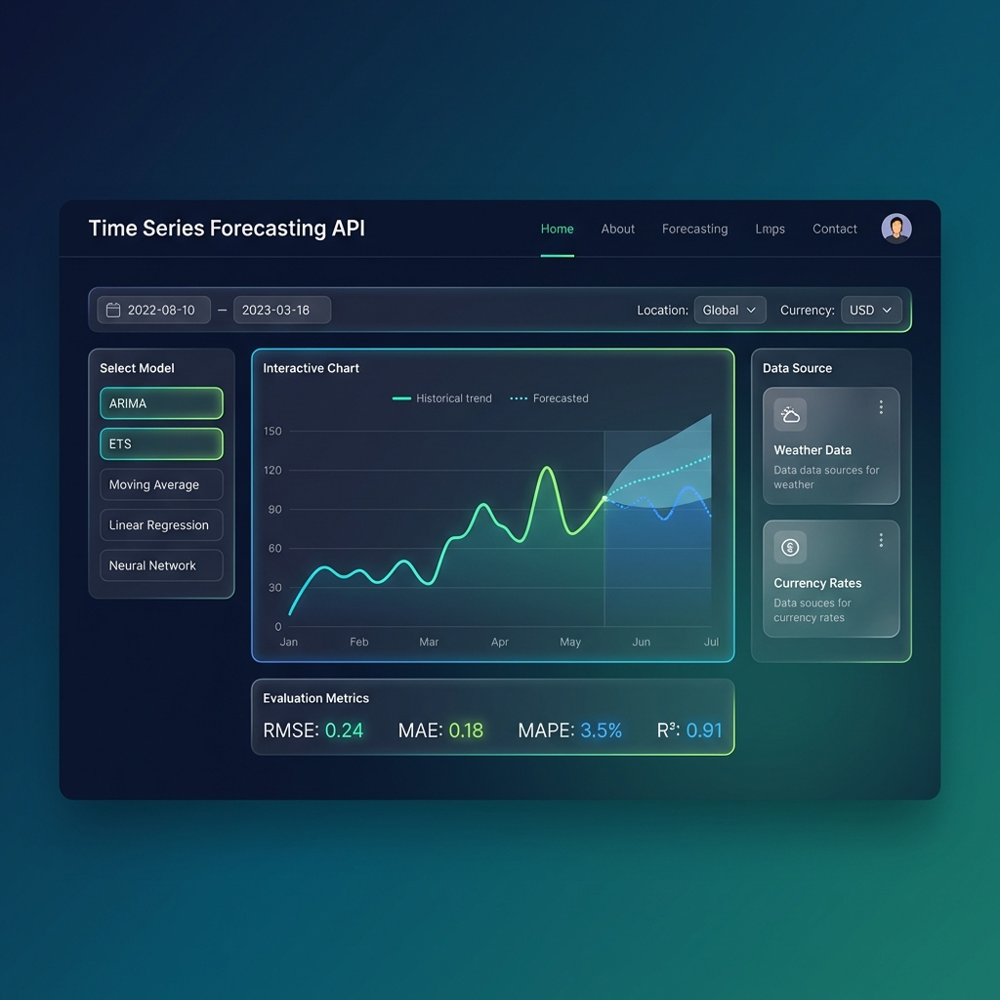

<div align="center">

# 📈 Time Series Forecasting API

[](https://python.org)
[](https://flask.palletsprojects.com/)
[](https://numpy.org/)
[](https://pandas.pydata.org/)
[](LICENSE)

**A powerful Flask-based REST API for time series forecasting and analysis**

*Fetch live data • Multiple forecasting models • Comprehensive evaluation metrics*

---

### 📊 UI Preview



</div>

---

## ✨ Features

<table>
<tr>
<td>

### 📡 Live Data Sources
- **Open-Meteo** - Weather data worldwide
- **Frankfurter** - Currency exchange rates
- **No API keys required!**

</td>
<td>

### 🧮 Statistical Models
- **ARIMA** - Autoregressive models
- **ETS** - Exponential smoothing
- **Moving Averages** - SMA, WMA, EMA

</td>
<td>

### 🤖 ML Models
- **Linear Regression** - Trend fitting
- **Polynomial** - Non-linear trends
- **Neural Networks** - Deep learning

</td>
</tr>
</table>

---

## 🚀 Quick Start

### Prerequisites

- Python 3.9+
- pip package manager

### Installation

```bash
# Navigate to directory
cd time_series_forecasting

# Create virtual environment
python -m venv venv
source venv/bin/activate  # Windows: venv\Scripts\activate

# Install dependencies
pip install -r requirements.txt

# Run the application
python app.py
```

🌐 API starts on `http://localhost:5001`

---

## 📡 API Endpoints

### 🏥 Health Check
```http
GET /api/v1/health
```

---

## 📦 Data Fetching

### 🌤️ Weather Data
```http
GET /api/v1/datasets/weather
```

| Parameter | Type | Default | Description |
|-----------|------|---------|-------------|
| `location` | String | `new_york` | Location name |
| `days` | Integer | `30` | Days of historical data |
| `variable` | String | `temperature_2m` | Weather variable |

**📍 Available Locations**: `new_york`, `london`, `tokyo`, `paris`, `sydney`, `mumbai`

```bash
curl "http://localhost:5001/api/v1/datasets/weather?location=london&days=14"
```

---

### 💱 Currency Data
```http
GET /api/v1/datasets/currency
```

| Parameter | Type | Default | Description |
|-----------|------|---------|-------------|
| `base` | String | `EUR` | Base currency code |
| `target` | String | `USD` | Target currency code |
| `days` | Integer | `30` | Days of historical data |

```bash
curl "http://localhost:5001/api/v1/datasets/currency?base=GBP&target=INR&days=30"
```

---

## 🔮 Forecasting Endpoints

### 📊 ARIMA Forecast
```http
POST /api/v1/forecast/arima
```

| Parameter | Type | Default | Description |
|-----------|------|---------|-------------|
| `values` | Array | *required* | Time series values |
| `timestamps` | Array | auto | Timestamps |
| `forecast_steps` | Integer | `10` | Steps to forecast |
| `order` | Array | `[5,1,0]` | ARIMA order `[p,d,q]` |

```bash
curl -X POST http://localhost:5001/api/v1/forecast/arima \
  -H "Content-Type: application/json" \
  -d '{"values": [10, 12, 14, 13, 15, 17, 16, 18, 20, 19], "forecast_steps": 5}'
```

---

### 📈 ETS Forecast
```http
POST /api/v1/forecast/ets
```

| Parameter | Type | Default | Description |
|-----------|------|---------|-------------|
| `values` | Array | *required* | Time series values |
| `forecast_steps` | Integer | `10` | Steps to forecast |
| `trend` | String | `add` | `add`, `mul`, or `null` |
| `seasonal` | String | `null` | `add`, `mul`, or `null` |
| `seasonal_periods` | Integer | `null` | Seasonal cycle length |

---

### 📉 Moving Average
```http
POST /api/v1/forecast/moving-average
```

| Parameter | Type | Default | Description |
|-----------|------|---------|-------------|
| `values` | Array | *required* | Time series values |
| `forecast_steps` | Integer | `10` | Steps to forecast |
| `window_size` | Integer | `5` | MA window size |
| `method` | String | `sma` | `sma`, `wma`, or `ema` |

---

### 📐 Linear Regression
```http
POST /api/v1/forecast/linear-regression
```

| Parameter | Type | Default | Description |
|-----------|------|---------|-------------|
| `values` | Array | *required* | Time series values |
| `forecast_steps` | Integer | `10` | Steps to forecast |
| `degree` | Integer | `1` | Polynomial degree |

---

### 🧠 Neural Network
```http
POST /api/v1/forecast/neural-network
```

| Parameter | Type | Default | Description |
|-----------|------|---------|-------------|
| `values` | Array | *required* | Time series values |
| `forecast_steps` | Integer | `10` | Steps to forecast |
| `sequence_length` | Integer | `10` | Input sequence length |
| `epochs` | Integer | `50` | Training epochs |

---

## ⚡ Pipeline Endpoints

*Complete data fetching + forecasting in one call!*

### 🌤️ Weather Forecast Pipeline
```http
GET /api/v1/pipeline/weather-forecast
```

| Parameter | Type | Default | Description |
|-----------|------|---------|-------------|
| `location` | String | `new_york` | Location name |
| `days` | Integer | `30` | Historical days |
| `forecast_steps` | Integer | `7` | Steps to forecast |
| `model` | String | `arima` | `arima`, `ets`, `ma`, `lr` |

```bash
curl "http://localhost:5001/api/v1/pipeline/weather-forecast?location=tokyo&model=ets&forecast_steps=7"
```

---

### 💱 Currency Forecast Pipeline
```http
GET /api/v1/pipeline/currency-forecast
```

| Parameter | Type | Default | Description |
|-----------|------|---------|-------------|
| `base` | String | `EUR` | Base currency |
| `target` | String | `USD` | Target currency |
| `days` | Integer | `30` | Historical days |
| `forecast_steps` | Integer | `7` | Steps to forecast |
| `model` | String | `arima` | Model to use |

---

## 📏 Evaluation Endpoints

### 📊 Evaluate Forecast
```http
POST /api/v1/evaluate
```

```bash
curl -X POST http://localhost:5001/api/v1/evaluate \
  -H "Content-Type: application/json" \
  -d '{"actual": [10, 12, 14, 13, 15], "predicted": [11, 13, 13, 14, 14]}'
```

### 🔄 Compare Models
```http
POST /api/v1/evaluate/compare
```

Compare multiple model predictions side by side.

---

## 🧠 Forecasting Models

<details>
<summary><b>📊 ARIMA (AutoRegressive Integrated Moving Average)</b></summary>

| Component | Description |
|-----------|-------------|
| **AR (p)** | Uses past values to predict future |
| **I (d)** | Differencing for stationarity |
| **MA (q)** | Uses past forecast errors |

**Best for**: Data with trends and autocorrelation

</details>

<details>
<summary><b>📈 ETS (Error, Trend, Seasonal)</b></summary>

| Method | Description |
|--------|-------------|
| **Simple** | No trend, no seasonality |
| **Holt's Linear** | Additive trend |
| **Holt-Winters** | Trend + seasonality |

**Best for**: Data with clear trend and/or seasonal patterns

</details>

<details>
<summary><b>📉 Moving Average</b></summary>

| Type | Description |
|------|-------------|
| **SMA** | Simple - equal weights |
| **WMA** | Weighted - linear weights |
| **EMA** | Exponential - exponential decay |

**Best for**: Short-term forecasting, trend smoothing

</details>

<details>
<summary><b>📐 Linear Regression</b></summary>

| Degree | Description |
|--------|-------------|
| 1 | Linear trend |
| 2 | Quadratic trend |
| 3+ | Higher-order polynomial |

**Best for**: Data with clear linear trends

</details>

<details>
<summary><b>🧠 Neural Network</b></summary>

| Feature | Description |
|---------|-------------|
| Input | Sequence of past values |
| Hidden | Configurable dense layers |
| Output | Next value prediction |

**Best for**: Complex non-linear patterns

</details>

---

## 📏 Evaluation Metrics

| Metric | Formula | Interpretation |
|--------|---------|----------------|
| **RMSE** | √(mean(errors²)) | Lower is better, penalizes large errors |
| **MAE** | mean(\|errors\|) | Lower is better, robust to outliers |
| **MAPE** | mean(\|errors/actual\|) × 100 | Percentage error |
| **SMAPE** | Symmetric MAPE | Handles zeros better |
| **R²** | 1 - (SS_res/SS_tot) | 1.0 = perfect, 0 = mean baseline |

---

## 📁 Project Structure

```
time_series_forecasting/
├── 📄 app.py                      # Flask application
├── 📄 requirements.txt            # Dependencies
├── 📁 assets/                     # UI assets & images
├── 📁 config/
│   └── settings.py                # Configuration
├── 📁 controllers/
│   └── forecast_controller.py     # REST API endpoints
├── 📁 services/
│   ├── base_analyzer.py           # Abstract base class
│   ├── 📁 statistical/
│   │   ├── arima_service.py
│   │   ├── ets_service.py
│   │   └── moving_average_service.py
│   ├── 📁 ml_based/
│   │   ├── linear_regression_service.py
│   │   └── neural_network_service.py
│   └── 📁 evaluation/
│       └── metrics_service.py
├── 📁 models/
│   ├── forecast_result.py
│   └── time_series_data.py
├── 📁 utils/
│   └── data_utils.py
└── 📁 external_apis/
    ├── base_client.py
    ├── open_meteo_client.py
    └── frankfurter_client.py
```

---

## 🌐 External APIs

<table>
<tr>
<td align="center">

### 🌤️ Open-Meteo
**URL**: [open-meteo.com](https://open-meteo.com/)

✅ No authentication required  
📊 10,000 requests/day  
🌍 Global weather data

</td>
<td align="center">

### 💱 Frankfurter
**URL**: [frankfurter.app](https://frankfurter.app/)

✅ No authentication required  
🏦 European Central Bank data  
📈 Historical exchange rates

</td>
</tr>
</table>

---

<div align="center">

## 📜 License

MIT License © 2024

---

**Made with ❤️ using Flask, NumPy, Pandas & Statsmodels**

</div>
